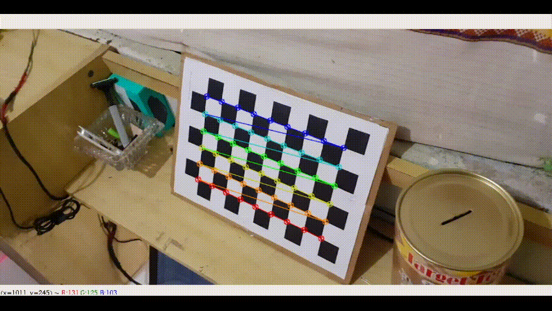
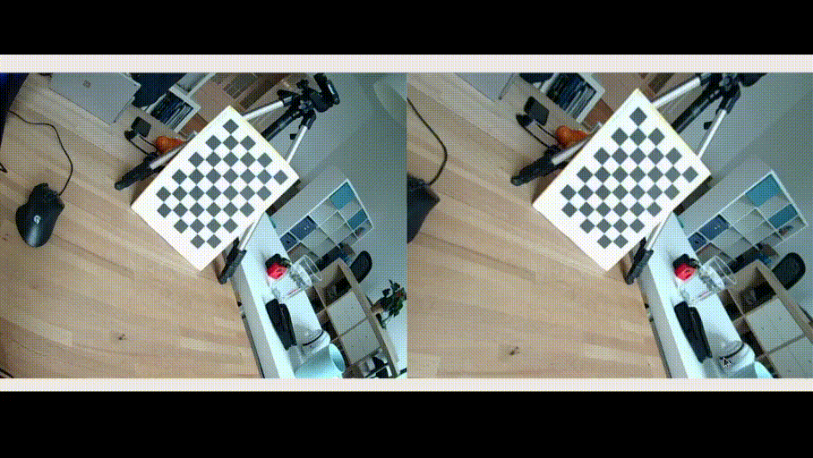

# Monocular Camera Calibration

This repository contains code for calibrating monocular cameras with a [chessboard pattern](docs/Checkerboard-A4-25mm-10x7.svg).



In order to calibrating the camera you can put the calibration photos into a separate folder (like `demo` or `yourfolder`) or take pictures using a webcam. To take pictures using the webcam you can run the code `get_images.py`

### Installation
You have to install some libraries first, run the code below:
```
pip install -r requirments.txt
```

### Get Image form Webcam
The code below can be run to take pictures via webcam. Press `s` to save the image and `q` to end the program.
```
python src/get_images.py ./directory_to_save start_index prefix

python src/get_images.py ./data 0 images_webcam
```

### Calibrating Camera
The purpose of camera calibration is to generate an intrinsic matrix (K). The program below will take the input image and generate a calibration matrix in `yml` file.
```
python src/calibration.py \
    --image_dir ./demo/data01 \
    --image_format png \
    --prefix img \
    --square_size 0.025 \
    --width 9 \
    --height 6 \
    --save_file ./demo/calib_data01.yml
```
```
usage: src/calibration.py [-h] --image_dir IMAGE_DIR --image_format
                           IMAGE_FORMAT --prefix PREFIX
                           [--square_size SQUARE_SIZE] [--width WIDTH]
                           [--height HEIGHT] --save_file SAVE_FILE

optional arguments:
  -h, --help            show this help message and exit
  --image_dir IMAGE_DIR
                        image directory path
  --image_format IMAGE_FORMAT
                        image format, png/jpg
  --prefix PREFIX       image prefix
  --square_size SQUARE_SIZE
                        chessboard square size
  --width WIDTH         chessboard width size, default is 9
  --height HEIGHT       chessboard height size, default is 6
  --save_file SAVE_FILE
                        YML file to save calibration matrices
```
The calibration file `yml` contains an intrinsic matrix (K) and a distortion matrix (D). As below:
```
%YAML:1.0
---
K: !!opencv-matrix
   rows: 3
   cols: 3
   dt: d
   data: [ 8.2074718315015139e+02, 0., 5.2705661714841142e+02, 0.,
       8.2003814588104046e+02, 2.3642917366196548e+02, 0., 0., 1. ]
D: !!opencv-matrix
   rows: 1
   cols: 5
   dt: d
   data: [ 3.0124329351197032e-01, -1.7139992852268171e+00,
       2.5721068961795258e-03, 2.7230187591786039e-03,
       4.5098343258595559e+00 ]
```

One of the uses of a calibration matrix is for image distortion, the image on the left is a distorted image, while the right is an image that has been undistorted, such as:



### Undistortion Image
In order undistortion image with calibration matrix, run:
```
python src/undistortion.py \
    --image_dir ./demo/data01 \
    --calib ./demo/calib_data01.yml \
    --output_dir ./demo/newdata01
```

### With Docker
You can also run programs using docker. Follow the commands below.
#### Build Docker
Pull docker image, run:
```
docker image pull ruhyadi/calibration:latest
```

#### Run Calibration Inside Docker
To make running the program easier, run `runDocker.sh`. If permission is denied run `chmod +x runDocker.sh` first.
```
./runDocker.sh
```
After that you will enter the docker terminal. Run the command below to calibrating camera.
```
python src/calibration.py \
    --image_dir ./demo/data02 \
    --image_format jpeg \
    --prefix M30_ \
    --square_size 0.025 \
    --width 9 \
    --height 6 \
    --save_file M30_calibration.yml
```

## Reference
- [Calibration OpenCV Docs](https://docs.opencv.org/3.4/dc/dbb/tutorial_py_calibration.html)
- [aliyasineser/stereoDepth](https://github.com/aliyasineser/stereoDepth)