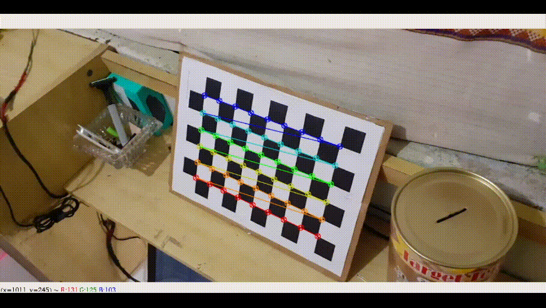

# Monocular Camera Calibration

This repository contains code for calibrating monocular cameras with a [chessboard pattern](docs/Checkerboard-A4-25mm-10x7.svg).



In order to calibrating the camera you can put the calibration photos into a separate folder (like `demo` or `yourfolder`) or take pictures using a webcam. To take pictures using the webcam you can run the code `get_images.py`

### Installation
You have to install some libraries first, run the code below:
```
pip install -r requirments.txt
```

### Get Image form Webcam
The code below can be run to take pictures via webcam. Press `s` to save the image and `q` to end the program.
```
python get_images.py ./directory_to_save start_index prefix

python get_images.py ./data 0 images_webcam
```

### Calibrating Camera
In order to calibrate camera, change parameters if needed and run:
```
python mono_calibration.py \
    --image_dir ./demo \
    --image_format jpeg \
    --prefix M30_ \
    --square_size 0.025 \
    --width 9 \
    --height 6 \
    --save_file M30_calibration.yml
```

### With Docker
You can also run programs using docker. Follow the commands below.
#### Build Docker
Pull docker image, run:
```
docker image pull ruhyadi/calibration:v1
```

#### Run Calibration Inside Docker
To make running the program easier, run `runDocker.sh`. If permission is denied run `chmod +x runDocker.sh` first.
```
./runDocker.sh
```
After that you will enter the docker terminal. Run the command below to calibrating camera.
```
python mono_calibration.py \
    --image_dir ./demo \
    --image_format jpeg \
    --prefix M30_ \
    --square_size 0.025 \
    --width 9 \
    --height 6 \
    --save_file M30_calibration.yml
```

## Reference
- [Calibration OpenCV Docs](https://docs.opencv.org/3.4/dc/dbb/tutorial_py_calibration.html)